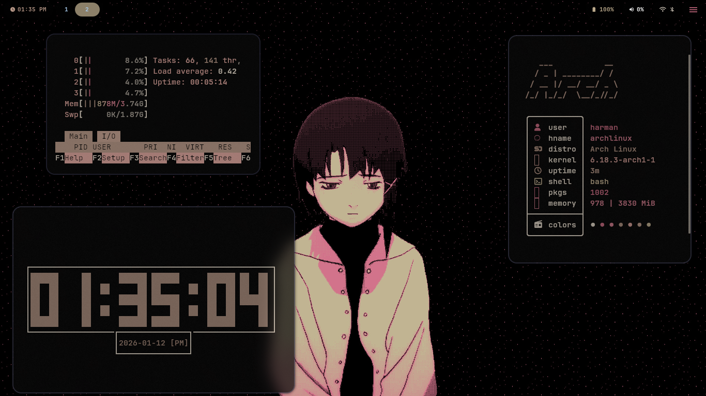
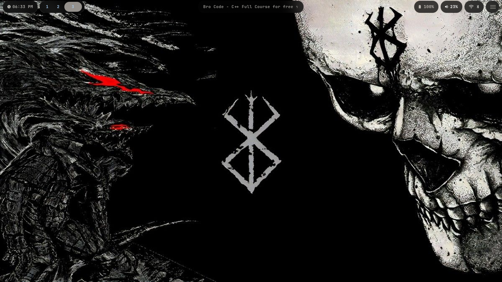

# Harman's HyprLand Config


| Component | Tool |
|-----------|------|
| **WM** | Hyprland |
| **Terminal** | Kitty |
| **Widgets** | QuickShell |
| **App Launcher** | Quickshell |
| **Lockscreen** | Hyprlock |
| **Notifications** | SwayNC |
| **Wallpapers** | swww + pywal |
| **Bar** | Quickshell |

## Screenshots





## Installation

```bash
git clone https://github.com/Harman1307/dotfiles-Hyprland.git
cd dotfiles-Hyprland
chmod +x install.sh
./install.sh
```
> Note: This will backup your existing config before installing 

Inspired by: ViegPhunt, binnewbs, Mon4sm, r/unixporn


### THANKS FOR READING :)

***NOTE***: I'm no longer maintaining this project. if you want you can check out the MangoWM config on my profile, which I'm currently maintaing. 
